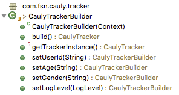
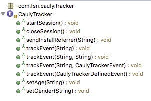

CAULY Tracking Android SDK
=======================
 
 본 문서는  애드 네트워크 파트너 혹은 광고주가 SDK API를 통해 타게팅을 위한 정보를 제공 연동 규격을 정의합니다.

----------

| 문서 버전 | 작성 날짜 | 작성자 및 내용 | 
| ---------- | ----------- | ---------------- |
| 1.0.0 | 2015.10.09 | 권대화(neilkwon at fsn.co.kr) - 초안작성 |
| 1.0.1 | 2016.04.06 | 권대화(neilkwon at fsn.co.kr) - 업데이트 내역 |
| 1.0.2 | 2016.04.28 | 권대화(neilkwon at fsn.co.kr) - 업데이트 내역 |
| 1.0.3 | 2016.05.16 | 권대화(neilkwon at fsn.co.kr) - 업데이트 내역(Purchase / ContentView(Product) Event 추가) |

### Table of contents
 - CAULY Tracking Android SDK
	- [연동 절차](#연동-절차)
	- [SDK 적용](#sdk-적용)
		- [Project Setting](#project-setting)
			- proguard
			- Initialize
		- [SDK 구조](#sdk-구조)
			- CaulyTrackerBuilder
			- CaulyTracker
		- [CaulyTrackerBuilder를 통한 초기화](#caulytrackerbuilder를-통한-초기화)
			- Sample
		- [Webview를 사용하는 Hybrid App 적용 가이드](#webview를-사용하는-hybrid-app-적용-가이드)
			- samlple
		- [Install Referrer Check](#install-referrer-check)
		- [Session](#session)
			- sample
		- [Event](#event)
			- [Custom Event](#custom-event)
				- name only sample
				- name / single param sample
			- [Defined Event](#defined-event)
				- Purchase
				- ContentView(Product)
	- [Cauly JS Inteface For WebView](#cauly-js-inteface-for-webview)
		- Inject javascript interface
			- sample
		- Get Platform String
			- sample
		- Get Google Advertising ID
			-sample


연동 절차
------------

1. 카울리 담당자 혹은 cauly@fsn.co.kr로 연락하여 트래킹 연동 광고주 파트너로 Track Code 발급을 요청하고 수신 합니다.
2. SDK 적용법을 참고하여 구현하고 검증합니다.
3. 카울리 담당자에게 SDK가 적용된 APK 파일을 전달 후 검증을 진행합니다.
검증 완료 후 배포 합니다. 

SDK 적용
------------
### Project Setting
#### proguard
Proguard 적용시에는 SDK에 적용되지 않도록 아래 설정을 추가
```
-keep class com.fsn.cauly.tracker.** { *; }
```

#### Initialize
AndroidManifest.xml 내에 meta data 태그로 발급받은 track code를 입력합니다. 
예시의 '[CAULY_TRACK_CODE]'부분을 변경합니다. ( [] 기호는 불필요 )
```xml
<application
...
 <meta-data
	android:name="cauly_track_code"
	android:value="[CAULY_TRACK_CODE]" />

...
</application>
```

### SDK 구조
#### CaulyTrackerBuilder
기본적인 설정 정보와 함께 CaulyTracker instance를 초기화합니다.
<br>



#### CaulyTracker
Event를 Tracking 할 수 있는 method들을 제공합니다.
<br>



### CaulyTrackerBuilder를 통한 초기화
| Method | mandatory | Description |
| --------- | ------------- | ------------- |
| setUserId | optional | 각 서비스를 사용하는 사용자의 고유 ID |
| setAge | optional | 사용자의 연령<br>연령 정보를 추가하면 더욱 세밀한 분석이 가능합니다.|
| setGender | optional | 사용자의 성별<br>성별 정보를 추가하면 더욱 세밀한 분석이 가능합니다. |
| setLogLevel | optional | 로그 출력 level<br>default : Info
| build | mandatory | tracker instance를 생성 |

#### Sample
```java
CaulyTrackerBuilder caulyTrackerBuilder = new CaulyTrackerBuilder(getApplicationContext());

caulyTracker = caulyTrackerBuilder.setUserId("customer_id_0922451")
				.setAge("25")
				.setGender(TrackerConst.FEMALE)
				.setLogLevel(LogLevel.Debug)
				.build();
```

userId, Age, Gender등의 정보는 Builder 로 초기화한 이후 CaulyTracker instance를 통해서도 변경가능합니다.

```java
try {
	CaulyTrackerBuilder.getTrackerInstance().setUserId("user_001");
	...
	
	CaulyTrackerBuilder.getTrackerInstance().setAge("20");
	...
	CaulyTrackerBuilder.getTrackerInstance().setGender(TrackerConst.FEMALE);
	...
} catch (CaulyException e) {
	// CaulyTracker Instance not initialized.
}
```

----------
### Webview를 사용하는 Hybrid App 적용 가이드
CaulyTracker Web SDK ( javascript version ) 을 사용는 Hybrid의 앱의 경우 App/Web의 더욱 정교한 Tracking 기능을 사용하고자 할 경우에는 [<i class="icon-file"></i> Cauly JS Inteface For WebView](#CaulyJSIntefaceForWebView) section을 참조해주세요.
 
#### samlple
```java
Webview web = new WebView(getApplicationContext());
web.addJavascriptInterface(new CaulyJsInterface(web),CaulyJsInterface.CAULY_JS_INTERFACE_NAME);
```

UIWebView를 사용하는 Hybrid App이 아닌 일반 브라우저에서 접근가능한 Web의 경우에는 해당 메시지를 호출하지않도록 조치를 해주어야 합니다.


------------------

### Install Referrer Check
앱 인스톨 시점에 설치 정보를 전송합니다.
Install Referer를 사용하는 방법은 아래의 2가지 형태가 있습니다. ( 하나의 방식만 구현)
 
- XML - CaulyTracker를 단독 Install referrer receiver 사용할때
```xml
<?xml version="1.0" encoding="utf-8"?>
<manifest xmlns:android="http://schemas.android.com/apk/res/android"
    package="com.neilkwon.fsntrackertester"
    android:versionCode="1"
    android:versionName="1.0" >

    <uses-sdk
        android:minSdkVersion="8"
        android:targetSdkVersion="21" />
    <uses-permission android:name="android.permission.INTERNET"/>

    <application
        android:allowBackup="true"
        android:icon="@drawable/ic_launcher"
        android:label="@string/app_name"
        android:theme="@style/AppTheme" >
        <activity
            android:name=".MainActivity"
            android:label="@string/app_name" >
            <intent-filter>
                <action android:name="android.intent.action.MAIN" />

                <category android:name="android.intent.category.LAUNCHER" />
            </intent-filter>
        </activity>
        <receiver android:name="com.fsn.cauly.tracker.InstallReceiver">
            <intent-filter>
                <action android:name="com.android.vending.INSTALL_REFERRER"/>
            </intent-filter>
        </receiver>

        <meta-data
            android:name="cauly_track_code"
            android:value="NEIL_TEST_CODE" />

    </application>

</manifest>
```

Source - 다수의 Install referrer receiver를 사용할 때
- INSTALL_REFERRER broadcast receiver로 등록된 Class 에서 아래와 같이 추가.

```java
import com.fsn.cauly.tracker.InstallReceiver;

public class OtherInstallReceiver extends BroadcastReceiver {

	public OtherInstallReceiver() {

	}

	@Override
	public void onReceive(Context context, Intent intent) {
		if (intent.getAction().equals("com.android.vending.INSTALL_REFERRER")) {
			String referrerStr = intent.getStringExtra("referrer");
			if (referrerStr != null) {
				try {

					//Cauly Install check
					// 간단한 설치 정보만 전송
					InstallReceiver installReceiver = new InstallReceiver();
					installReceiver.onReceive(context, intent);

					// Other tracker 1 - 타사SDK
					InstallReceiverEtc1  installReceiverEtc1 = new InstallReceiverEtc1();
					installReceiverEtc1.onReceive(context, intent);

					// Other tracker 2 - 타사SDK
					InstallReceiverEtc2 installReceiverEtc2 = new InstallReceiverEtc2();
					installReceiverEtc2.onReceive(context, intent);

				} catch (Exception e) {

				}
			}
		}
	}

}

```


------------------

### Session
Tracking을 시작하는 시점과 종료하는 시점에 호출. CaulyTrackerBuilder를 통해 tracker instance를 초기화 하는 단계에서 ‘start’를 호출하는 것이 권장됩니다.

#### sample
startSession
```java
@Override
protected void onCreate(Bundle savedInstanceState) {
	super.onCreate(savedInstanceState);
	setContentView(R.layout.activity_main);

	CaulyTrackerBuilder caulyTrackerBuilder = new CaulyTrackerBuilder(getApplicationContext());

	CaulyTracker caulyTracker = caulyTrackerBuilder.setUserId("customer_id_0922451")
			.setAge("25")
			.setGender(TrackerConst.FEMALE)
			.setLogLevel(LogLevel.Debug)
			.build();
	caulyTracker.startSession();
}
```
또는  Android Activity LifeCycle 중 Activity가 Active 상태가 될때 Callback을 받는 overrided method중에 한 곳에 작성합니다.

```java
@Override
protected void onResume() {
	super.onResume();
	try {
		CaulyTrackerBuilder.getTrackerInstance().startSession();
	} catch (CaulyException e) {
		e.printStackTrace();
	}
}
```

close
```java
@Override
protected void onDestroy() {
	super.onDestroy();
	try {
		CaulyTrackerBuilder.getTrackerInstance().closeSession();
	} catch (Exception e) {
		e.printStackTrace();
	}
}
```


### Event
사용자 또는 System에서 발생하는 Event를 Tracking 합니다.

#### Custom Event
| Parameter | Required | Description |
|-----------|----------|-------------|
| event_name | mandatory | 트래킹할 이벤트명 |
| event_param | optional | 세부 정보 등 이벤트에 추가적으로 기입할 값 |


##### name only sample
```java
caulyTracker.trackEvent("event1_nameonly");
```
##### name / single param sample
```java
caulyTracker.trackEvent("event2_string", "test");
```

#### Defined Event
자주 사용되거나 또는 중요하다 판단되는 Event에 대한 선정의된 Event입니다.

##### Purchase
구매 또는 지불이 발생하였을때 호출

| Parameter | Type |Required | Default | Description |
| --------- | ---- | ------- | ------- | ----------- |
| order_id | String | mandatory | - | Order ID |
| order_price | String | mandatory | - | 발생한 전체 금액 |
| purchase_type | String | optional | - | 구매의 성격<br>eg)재구매 : RE-PURCHASE |
| product_infos | List<Product> | mandatory | - | 구매된 상품의 상세 정보 목록<br>최소 1개 이상 상품이 등록되어야 합니다. |
| currency_code | String | optional | KRW | 통화 코드 |

```java
CaulyTrackerPurchaseEvent purchaseEvent = new CaulyTrackerPurchaseEvent();

String productId = "p_0344411";
String productPrice = "20000";
String productQuantity = "3";
Product product = new Product(productId, productPrice, productQuantity);

String productId2 = "p_0344412";
String productPrice2 = "10000";
String productQuantity2 = "1";
Product product = new Product(productId2, productPrice2, productQuantity2);

purchaseEvent.setOrderId("order_20160430");
purchaseEvent.setOrderPrice("70000");
purchaseEvent.addProuduct(product);
purchaseEvent.addProuduct(product2);
purchaseEvent.setCurrencyCode(TrackerConst.CURRENCY_KRW);

CaulyTrackerBuilder.getTrackerInstance().trackEvent(purchaseEvent);
```

##### ContentView(Product)
Content에 대한 트래킹

--------------

Cauly JS Inteface For WebView
-----------------------------
### Inject javascript interface
#### sample

```java
private WebView testWebview;

private final String TAG = "WEB";

@Override
protected void onCreate(Bundle savedInstanceState) {
	super.onCreate(savedInstanceState);
	setContentView(R.layout.activity_webview);

	testWebview = (WebView) findViewById(R.id.testWebview);

	testWebview.getSettings().setJavaScriptEnabled(true);
	testWebview.setWebChromeClient(new WebChromeClient() {
		@Override
		public boolean onJsAlert(final WebView view, final String url, final String message, JsResult result) {
			Log.d(TAG, "onJsAlert(!" + view + ", " + url + ", " + message + ", " + result + ")");
			Toast.makeText(getApplicationContext(), message, 3000).show();
			result.confirm();
			return true;
		}
	});
	testWebview.setWebViewClient(new WebViewClient());
	testWebview.clearCache(true);
	testWebview.loadUrl("http://[TESTURL]/test.html?t="+System.currentTimeMillis());
	testWebview.addJavascriptInterface(new CaulyJsInterface(testWebview),CaulyJsInterface.CAULY_JS_INTERFACE_NAME);

}

```

### Get Platform String
Native SDK의 platform (Android / iOS) 값을 얻습니다. 리턴값은 ‘Android’ 또는 ‘iOS’ 입니다.
#### sample
```javascript
if(window.caulyJSInterface.platform() == 'Android'){
...
}else if(window.caulyJSInterface.platform() == 'iOS'){
...
}
```
```html
<!DOCTYPE html>
<html>
<head>
<meta charset="UTF-8">
<title>This is Cauly Web</title>

<script type="text/javascript">
	window.onload = function() {
		if (window.caulyJSInterface) {
			var platform = window.caulyJSInterface.platform();
			document.getElementById('platform').innerText = platform;
		}
	}
</script>
</head>
<body>
	<div id="platform"></div>
	<a href="javascript:location.reload();">Reload</a>
</body>
</html>
```


### Get Google Advertising ID
Android Play service에서 제공하는 Google Advertising ID를 얻습니다.
#### sample
테스트 웹페이지에 SDK를 통해 얻은 gaid를 출력합니다.
```html
<!DOCTYPE html>
<html>
<head>
<meta charset="UTF-8">
<title>This is Cauly Web</title>

<script type="text/javascript">
	window.onload = function() {
		if (window.caulyJSInterface) {
			if(window.caulyJSInterface.platform() == "Android"){
				var gaid = window.caulyJSInterface.getAdId();
				document.getElementById('adid').innerText = gaid;
			}
		}
	}
</script>
</head>
<body>
	<div id="adid"></div>
	<a href="javascript:location.reload();">Reload</a>
</body>
</html>
```


